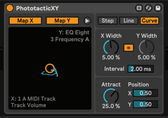

# Phototactic XY

## What is this?
A Max for Live device; typical but the most uncertain XY pad.
Simulates a bug randomly flies being attracted by light.
## Download
https://maxforlive.com/library/device/8437/phototactic-xy
## Parameters
* `Mode` Switches the behavior of movements.
  - `Step` Changes position at interval time.
  - `Line` moves in a straight line and changes direction at interval time.
  - `Curve` Accelerates towards the randomized position. In this mode, the width of movement is halved to suppress overrun by acceleration.
 
*The image of automation in each mode*

* `X Width` Represents the ratio of movements for X coordinate.

* `Y Width` Represents the ratio of movements for Y coordinate.

* `Link Width` Toggles to equal the X and Y width.

* `Interval` Represents the interval time of movements.
It moves every sample in 0ms but most parameters in devices/plugins would not be supported to the rate.

* `Attract` Represents the ratio how random movements is attracted by the attractor.

* `X Position` Represents the X coordinate of the attractor.
(orange circle in default Live themes)

* `Y Position` Represents the Y coordinate of the attractor.
(orange circle in default Live themes)

* `X: map` / `Y: map`
Press and select a parameter to map by each coordinate.
Press again to cancel mapping.

* `fold`/`unfold` Toggles to fold/unfold the advanced parameters.

* `X-Y Control`
Click or drag to move the circle as the attractor. (orange in default Live themes)